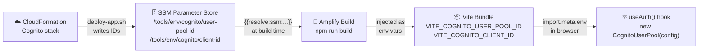
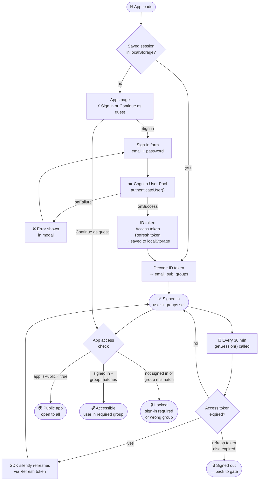

# Internal Tools Platform

A serverless monorepo that hosts internal tools and personal projects at [jtamerius.com](https://jtamerius.com). Each app lives under `apps/`, shares a single AWS Cognito User Pool for authentication, and is deployed independently to AWS Amplify Hosting via GitHub Actions.

---

## Architecture Overview

```
GitHub (jtamerius/portfolio)
        │
        ├── push → staging branch ──────► GitHub Actions (auto-deploy)
        │                                         │
        └── push → main branch ───────────► GitHub Actions (auto-deploy)
                                                  │
                                    ┌─────────────┼─────────────┐
                                    ▼             ▼             ▼
                              CloudFormation  CloudFormation  AWS Amplify
                              shared stacks  app stacks      (frontend build
                              (Cognito, IAM, (SSM params,    + hosting)
                               DNS/ACM)       future APIs)
```

**Domain layout:**

| Environment | Domain                        | Branch     |
|-------------|-------------------------------|------------|
| Production  | `tools.jtamerius.com`         | `main`     |
| Staging     | `tools.staging.jtamerius.com` | `staging`  |

---

## Repository Structure

```
portfolio/
├── apps/
│   └── landing-page/           # Vite + React SPA — tools.jtamerius.com
│       ├── amplify.yml         # Amplify build spec (monorepo appRoot)
│       ├── src/
│       │   ├── config/apps.js  # Registry of all platform apps
│       │   └── hooks/useAuth.js# Cognito auth hook
│       └── .env.example        # Required environment variables
│
├── infra/
│   ├── shared/
│   │   ├── cognito/            # Cognito User Pool + groups + client
│   │   ├── iam/                # GitHub Actions OIDC role + Amplify service role
│   │   ├── amplify/            # Amplify Hosting app + branch resources
│   │   └── dns/                # ACM certificates + Route 53 config
│   └── apps/
│       └── landing-page/       # SSM params (Cognito IDs) for the landing page
│
├── shared/
│   ├── auth/                   # Shared auth package (useAuth, Cognito helpers)
│   ├── ui/                     # Shared UI component library
│   └── config/                 # Shared platform config (env, feature flags)
│
├── src/                        # Python data/geo utilities (legacy/research code)
│
├── docs/
│   ├── architecture.md         # Deep-dive: CI/CD, auth, infra design decisions
│   ├── adding-new-app.md       # Step-by-step guide to add a new app
│   ├── auth.md                 # Cognito groups, useAuth hook, access control
│   └── secrets.md              # What's safe to expose, GitHub Secrets reference
│
├── .github/
│   └── workflows/
│       ├── ci.yml              # Lint, test, build + validate CloudFormation on PRs
│       ├── deploy-staging.yml  # Auto-deploy on push to staging
│       └── deploy-production.yml # Deploy on push to production (manual approval)
│
└── config/
    └── file_paths.yaml         # Shared path configuration
```

---

## Getting Started

### Prerequisites

| Tool | Version | Notes |
|------|---------|-------|
| Node.js | 20.x | Use [nvm](https://github.com/nvm-sh/nvm) or [fnm](https://github.com/Schniz/fnm) |
| npm | 10.x | Comes with Node 20 |
| AWS CLI | v2 | Only needed for infra work |
| Git | any | — |

### Setup

```bash
# 1. Clone the repo
git clone https://github.com/jtamerius/portfolio.git
cd portfolio

# 2. Install dependencies for the landing page
cd apps/landing-page
npm ci

# 3. Copy and fill in the environment variables
cp .env.example .env.local
# Edit .env.local with real Cognito values (see docs/secrets.md)
```

---

## Running Locally

```bash
cd apps/landing-page
npm run dev
# App available at http://localhost:5173
```

Auth will work as long as `VITE_COGNITO_USER_POOL_ID` and `VITE_COGNITO_CLIENT_ID` point to a real User Pool. You can use staging Cognito values locally — they are safe to use in `.env.local` (see [docs/secrets.md](docs/secrets.md)).

---

## Adding a New App

See [docs/adding-new-app.md](docs/adding-new-app.md) for the full step-by-step guide covering:

- Scaffolding a new Vite + React app under `apps/<app-name>/`
- Creating an `infra/apps/<app-name>/template.yaml` stack
- Registering the app in `apps/landing-page/src/config/apps.js`
- Wiring up GitHub Actions path filters and Amplify secrets

---

## Deployment

### Staging (automatic)

Push to the `staging` branch. GitHub Actions will:

1. Detect which parts of the monorepo changed (paths-filter)
2. Deploy any changed shared infra stacks via CloudFormation
3. Deploy any changed app infra stacks
4. Trigger an Amplify build for changed apps and poll until complete

### Production (automatic on push to `main`)

Merge to `main` (typically via PR from `staging`). The same workflow runs automatically — no manual approval step. Branch protection on `main` is the gate: require a passing PR review before merge.

To promote staging → production:

```bash
# Open a PR from staging → main in GitHub, get it reviewed, then merge.
# The deploy-production workflow fires automatically on merge.
```

---

## Infrastructure

CloudFormation stacks are organized in two layers:

**Shared stacks** (deployed once per environment, reused by all apps):

| Stack path | Purpose |
|------------|---------|
| `infra/shared/iam/` | GitHub Actions OIDC role, Amplify service role |
| `infra/shared/cognito/` | Cognito User Pool, groups (guest/member/admin), app client |
| `infra/shared/dns/` | ACM certificates, Route 53 config |
| `infra/shared/amplify/` | Amplify Hosting app + branch resources |

**App stacks** (one per app per environment):

| Stack path | Purpose |
|------------|---------|
| `infra/apps/landing-page/` | SSM params for Cognito IDs; future: API Gateway, Lambda, DynamoDB |

Stack outputs use CloudFormation exports (`!ImportValue`) so app stacks can reference shared resources without hard-coding IDs.

See [docs/architecture.md](docs/architecture.md) for the full dependency graph and design decisions.

---

## Authentication

All apps share a single Cognito User Pool (`tools-platform-<env>`). Access is controlled by group membership:

| Group | Precedence | Intended use |
|-------|-----------|--------------|
| `admin` | 1 | Platform administrators |
| `member` | 2 | Authenticated users with standard access |
| `guest` | 3 | Limited / read-only access |

The `useAuth` hook (in `shared/auth/` and mirrored in each app's `src/hooks/`) exposes `{ user, groups, isLoading, signIn, signOut }`. To gate a component:

```jsx
const { groups } = useAuth()
if (!groups.includes('member')) return <AccessDenied />
```

See [docs/auth.md](docs/auth.md) for the full guide including invite flows, token lifecycle, and AWS CLI commands to manage users.

### How Cognito config reaches the browser

Cognito IDs (User Pool ID and Client ID) are never hard-coded. They flow from CloudFormation through SSM into Amplify's build environment:



### Runtime auth flow

What happens from page load through sign-in to access control:



---

## Domain Structure

| Subdomain | App | Environment |
|-----------|-----|-------------|
| `tools.jtamerius.com` | landing-page | production |
| `tools.staging.jtamerius.com` | landing-page | staging |
| `<app>.jtamerius.com` | future apps | production |
| `<app>.staging.jtamerius.com` | future apps | staging |

Certificates are managed by ACM (`infra/shared/dns/`) and validated via Route 53 DNS records. Custom domains are attached to Amplify apps in the Amplify console or via CloudFormation after the app is created.

---

## GitHub Actions Workflows

| Workflow | Trigger | Purpose |
|----------|---------|---------|
| `ci.yml` | PR → `staging` or `main` | Lint, test, build apps; validate CloudFormation templates |
| `deploy-staging.yml` | Push → `staging` | Deploy changed infra + trigger Amplify builds |
| `deploy-production.yml` | Push → `main` | Same as staging, auto-deploy (branch protection is the gate) |

All workflows use OIDC federation (`aws-actions/configure-aws-credentials`) — no long-lived AWS credentials are stored in GitHub.

---

## Environment Variables Reference

### `apps/landing-page`

| Variable | Required | Example | Notes |
|----------|----------|---------|-------|
| `VITE_COGNITO_USER_POOL_ID` | Yes | `us-east-1_AbCdEfGhI` | Safe to expose in frontend |
| `VITE_COGNITO_CLIENT_ID` | Yes | `1abc2defghij3klmno4pqrst5` | Safe to expose in frontend |
| `VITE_ENV` | No | `staging` | Set automatically by Amplify |

For local development copy `apps/landing-page/.env.example` to `.env.local` and fill in real values.

### GitHub Secrets (repository level)

| Secret | Used by | Purpose |
|--------|---------|---------|
| `AWS_ROLE_ARN` | All workflows | IAM role assumed via OIDC |
| `GITHUB_OAUTH_TOKEN` | deploy workflows | Amplify-to-GitHub repo connection |
| `AMPLIFY_APP_ID_LANDING_PAGE` | deploy workflows | Amplify app ID for triggering builds |

See [docs/secrets.md](docs/secrets.md) for the full secrets guide.
