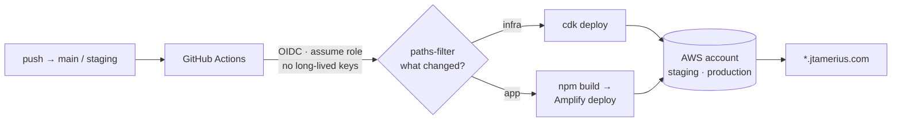

# Tools Platform

Seven web apps I designed, built and run on AWS from a single monorepo — including a
continental-scale hail-exposure pipeline for solar sites and a traffic-camera computer-vision
system. Every production URL below is live right now.

[](https://github.com/jtamerius/tools-platform/actions/workflows/ci.yml)
[](LICENSE)

**Live:** [Hailstoned](https://hailstoned.jtamerius.com) ·
[Purgatory Crowding](https://purg.jtamerius.com) ·
[Ensemble Weather](https://weather.jtamerius.com) ·
[platform home](https://tools.jtamerius.com)

<!-- SCREENSHOT SLOT — add before publishing:
     docs/assets/hailstoned.png  (deck.gl CONUS hail map with the viewport stats panel visible)
     Replace this comment with:  
-->

---

## Start here: the detector that was blind to the bug it existed to catch

In July, camera 3291-E lost about three quarters of its vehicle counts in a single week and never
recovered. Detector confidence and image brightness were unchanged across the drop, so the model
was fine — the camera was looking somewhere else.

The first version of the health check compared a trailing 21-day window against the 42 days before
it. Run against production data, it returned `ok` for 3291-E. A trailing comparison only sees a
break while the break is still recent; two months on, the broken level has become its own baseline
and the camera reads as healthy again. That is exactly how the camera stayed invisible in the first
place, and a detector that reproduces the bug it exists to catch is worse than none.

The rewrite scans every admissible split point in the series and keeps the deepest sustained drop,
then requires that detector confidence held steady across it — a drop in counts *without* a drop in
confidence is a camera problem, not a quiet road. The failure mode is pinned by a test that builds
50 healthy days followed by 60 broken ones, so the break is nowhere near the end of the series.

- [`apps/purgatory/frontend/src/lib/health.js`](apps/purgatory/frontend/src/lib/health.js) — the
  detector, with the reasoning in the header
- [`apps/purgatory/frontend/src/lib/__tests__/detector-window.test.js`](apps/purgatory/frontend/src/lib/__tests__/detector-window.test.js)
  — the regression test

If you only read two files here, read those.

---

## Hailstoned — hail exposure for US solar, from raw radar

**[hailstoned.jtamerius.com](https://hailstoned.jtamerius.com)** · public, no sign-in ·
[`apps/solarhail/`](apps/solarhail/)

A single severe hail event can total a solar array. The radar record that would tell you where hail
actually falls is public, but it arrives as terabytes of raw grids, so it mostly goes unread.

The pipeline reads NOAA MRMS maximum-hail-size grids straight out of the public S3 archive —
fetched and gunzipped in memory, staged to a temp file only because pygrib needs a path, and never cached — snaps hail pixels to H3 resolution-8 cells keeping
the largest size seen per cell, then joins each cell to where solar actually sits: 6,611
utility-scale facilities from the USGS photovoltaic database, residential estimates from Stanford's
DeepSolar, and Overture building footprints. Output is catalogued in Glue with partition
projection, so Athena needs no crawler and no manual partition registration.

Decoding every grid for every day would dominate the runtime, so the run is gated on weather: an
index of NWS severe-thunderstorm and tornado warning polygons is built once from Iowa State's IEM
archive, and only (metro, date) pairs a warning actually covers get decoded. That removes 80–90% of
the GRIB work, with a `--no-prefilter` flag so a known storm day can still be forced through in
testing.

It runs as an AWS Batch job on Fargate Spot with retry-on-reclaim. The frontend is deck.gl over
Mapbox, served as a static site, and the statistics panel recomputes for whatever is in the viewport
rather than serving a precomputed national total. It covers a fixed historical window in spring 2026
rather than live radar, which is why it costs almost nothing to leave running.

Seven pipeline stages, one test file each, 50 tests:
[`apps/solarhail/pipeline/`](apps/solarhail/pipeline/).

## Purgatory — a corridor sensor, still collecting

**[purg.jtamerius.com](https://purg.jtamerius.com)** · public, no sign-in ·
[`apps/purgatory/`](apps/purgatory/)

**There is no crowding prediction model yet, and there won't be until a full ski season is on
disk.** What exists is the sensor and the labeled history it is building — more than 100,000 frames
since May.

Every fifteen minutes, ten CDOT traffic cameras along the US-550 approach to Purgatory Resort are
sampled. Each frame goes through a YOLO detector in a container Lambda with per-camera polygon zones
(so a count is directional, not just "vehicles in frame"), and is enriched with image statistics,
road-weather sensor readings, and solar geometry from the same moment. A three-tier Claude agent on
Bedrock reviews flagged records — metadata first, image second, neighbour propagation third —
behind a DynamoDB monthly invocation cap, so a bad day cannot run up a bill. A review UI lets me
page through flagged frames and correct counts by hand; those corrections become the training
labels.

Two pieces are worth reading regardless of the missing model.

**Rollup cells.** The dashboard needs a baseline drawn from all history while the view shows a
window. Those are different data extents, so no amount of client-side memoising is correct; before
the rollup Lambda existed, the page pulled the entire ~82 MB ingest table into the browser, twice.
Now one row per (camera × date × hour) stores sufficient statistics — count, sum, sum of squares —
never pre-averaged values, so cells merge by addition at any depth and every time scale downstream
is a summation depth over one artifact instead of a different query shape. Mountain-time DST is
handled explicitly: a spring-forward day is 92 ticks, not 96.
[`apps/purgatory/rollup/src/handler.py`](apps/purgatory/rollup/src/handler.py)

**The corridor is one-dimensional, so the UI is too.** Ten stations on a single road are not
two-dimensional data; the display orders them by milepost instead of putting them on a map. The
23-mile stretch between the resort pair and the next camera has no coverage at all, and the UI draws
that gap explicitly — ten evenly spaced rows would imply even coverage that does not exist.
[`apps/purgatory/frontend/src/lib/cams.js`](apps/purgatory/frontend/src/lib/cams.js)

The frontend entry bundle is 226 kB, down from 4,926 kB, mostly by importing
`react-plotly.js/factory` against `plotly.js-dist-min` instead of the default full build.

---

## Everything that's deployed

| App | What it does | Live | Code |
|---|---|---|---|
| **Hailstoned** | Streams NOAA MRMS radar into an H3 hex grid and joins it to where solar hardware actually sits, across the lower 48 | [hailstoned.jtamerius.com](https://hailstoned.jtamerius.com) | [`apps/solarhail`](apps/solarhail/) |
| **Purgatory Crowding** | Counts vehicles on ten CDOT traffic cameras every 15 minutes to build a labeled history of ski-day crowding | [purg.jtamerius.com](https://purg.jtamerius.com) | [`apps/purgatory`](apps/purgatory/) |
| **Ensemble Weather** | Plots GFS / NAM / HRRR on shared axes so you can see how much the models disagree before trusting a forecast | [weather.jtamerius.com](https://weather.jtamerius.com) | [`apps/weather/frontend`](apps/weather/frontend/), [`apps/weather/pipeline`](apps/weather/pipeline/) |
| **Investment Tracker** | Parses statement emails on arrival via SES into a payment ledger, with per-cell manual overrides | [investments.jtamerius.com](https://investments.jtamerius.com) · *sign-in* | [`apps/investment-tracker`](apps/investment-tracker/), [`-api`](apps/investment-tracker/api/) |
| **Finance Tracker** | Personal spending ledger — one Python Lambda over flat files in S3, no database | [finance.jtamerius.com](https://finance.jtamerius.com) · *sign-in* | [`apps/finance/frontend`](apps/finance/frontend/) |
| **Platform home** | App directory and a long-form page per app | [tools.jtamerius.com](https://tools.jtamerius.com) | [`apps/landing-page`](apps/landing-page/) |

Four are public and need no account. Three hold my own financial and personal data and sit behind
Cognito — those links resolve to a sign-in wall, not a broken page, so judge them by the code and
the infrastructure rather than the URL.

App URLs and access rules live in one registry,
[`shared/config/src/apps.js`](shared/config/src/apps.js), which the landing page reads rather than
keeping its own copy.

---

## How it ships



| | |
|---|---|
| **Infrastructure as code** | 11 CDK stack classes → 16 stacks in staging, 17 in production ([`infra/cdk`](infra/cdk)) |
| **Environments** | `staging` and `production`, same stacks, different context |
| **CI/CD credentials** | GitHub Actions federates via OIDC and assumes a role per run — no long-lived access keys in the repo or in GitHub Secrets |
| **Build selectivity** | `dorny/paths-filter` — a change to one app builds one app |
| **Shared code** | npm workspaces: [`shared/auth`](shared/auth), [`shared/ui`](shared/ui), [`shared/config`](shared/config) |
| **Auth** | One Cognito user pool, group-gated; the public apps skip it entirely |
| **Hosting** | 7 Amplify apps, Route 53 + ACM, all on custom subdomains |

Push to `staging` deploys staging; merge to `main` deploys production. Production deploys use a
`concurrency` group that queues rather than cancels — cancelling a half-finished production deploy
is worse than waiting for it.

Nothing here is a running server. Frontends are static builds on Amplify, backends are Lambdas, the
heavy pipeline is Batch on Fargate Spot, and the Bedrock QC agent is capped by a counter in
DynamoDB. The platform idles at close to nothing.

---

## Where to look first

| File | Why |
|---|---|
| [`apps/purgatory/rollup/src/handler.py`](apps/purgatory/rollup/src/handler.py) | Sufficient statistics that merge at any depth, and why a 2-hour incremental pass must still rewrite the whole day row |
| [`apps/purgatory/frontend/src/lib/health.js`](apps/purgatory/frontend/src/lib/health.js) | The changepoint detector, including the header explaining why the first version was blind |
| [`apps/solarhail/pipeline/src/main.py`](apps/solarhail/pipeline/src/main.py) | Pipeline orchestration and the pre-filter trade-off, stated where it was made |
| [`infra/cdk/bin/app.ts`](infra/cdk/bin/app.ts) | Every stack in both environments, in one file |

## Repository structure

```
apps/
  solarhail/               Hailstoned — pipeline/ (Python, Batch), api/, frontend/ (deck.gl)
  purgatory/               ingest/ scrape/ rollup/ api/ (Python Lambdas) + frontend/ (React)
  weather-app/             Ensemble Weather frontend (React)
  weather-pipeline/        Ensemble collector and clustering (Python)
  landing-page/            Platform home and per-app info pages
  investment-tracker/      + investment-tracker-api/  (React + Express on Lambda)
  finance-app/             React frontend over a single Python Lambda
shared/
  config/                  App registry — URLs and access rules
  auth/                    Cognito hooks
  ui/                      Shared nav and sign-in
infra/cdk/                 11 stack classes, two environments, one bin/app.ts
.github/workflows/         ci · deploy-staging · deploy-production
docs/                      Architecture notes for the two flagship systems
```

## Running it locally

Requires Node 20+ and Python 3.11+.

```bash
npm ci                                              # workspaces: apps/* and shared/*
npm run dev  --workspace=apps/landing-page          # http://localhost:5173
npm run lint --workspaces --if-present
npm run test --workspaces --if-present
```

The Hailstoned and Purgatory frontends are standalone npm projects rather than workspace members:

```bash
cd apps/purgatory/frontend && npm ci && npm run dev
cd apps/solarhail/frontend && npm ci && npm run dev
```

Python suites:

```bash
cd apps/solarhail/pipeline && pip install -r requirements.txt && pytest
cd apps/purgatory/rollup   && pip install -r requirements.txt && pytest
```

The public frontends read live production APIs and need no AWS credentials. The sign-in apps need
`VITE_COGNITO_USER_POOL_ID` and `VITE_COGNITO_CLIENT_ID` in `.env.local`; staging values are safe to
use locally.

### Tests

| Suite | Covers |
|---|---|
| [`apps/solarhail/pipeline/tests/`](apps/solarhail/pipeline/tests/) | 50 tests, one file per pipeline stage — radar read, H3 snap, the three joins, impact calc, pre-filter, downloader |
| [`apps/purgatory/rollup/tests/`](apps/purgatory/rollup/tests/) | Cell merge associativity, store/rebuild round-trip, DST day lengths |
| [`apps/purgatory/frontend/src/lib/__tests__/`](apps/purgatory/frontend/src/lib/__tests__/) | Corridor logic and the changepoint regression above |

## Decisions worth defending

Small choices, each with a reason recorded where it was made.

- **Sufficient statistics, not averages.** A day row rebuilt from stored hour cells is identical to
  a direct rebuild, and the test asserts that equality, because it is the property the whole design
  rests on.
- **No client-side aggregation for the Purgatory dashboard.** The baseline and the view are
  different data extents, so caching in the browser cannot be made correct. Hence the rollup tier.
- **No trailing-window health check.** It goes blind about two months after a break, which is how
  the broken camera stayed invisible in the first place.
- **The rollup Lambda's `requirements.txt` is deliberately empty.** The CDK bundler runs `pip
  install -t` on the build host, so any binary wheel would ship darwin/arm64 objects into an x86-64
  Lambda and fail at import. Stdlib plus the runtime's boto3 is the whole dependency set, and the
  file says so.
- **Gate expensive work on cheap metadata.** The NWS warning pre-filter cuts MRMS decoding by
  80–90%, with an explicit flag to bypass it when replaying a specific storm day.
- **Two Batch queues, on purpose.** Long pipeline runs go to Fargate Spot with retry-on-reclaim;
  short maintenance jobs go to an on-demand queue so they never compete with a Spot reclaim.
- **No live radar for Hailstoned.** A fixed historical window deploys as a static site, which is
  what makes it cost near zero to leave running. Making it live is a scheduling change, not a
  redesign — it just isn't done.

## Known rough edges

I would rather you hear these from me than find them.

- **Two generations of infrastructure code.** `infra/cdk` is authoritative and is what the deploy
  workflows actually run. Some earlier hand-written CloudFormation is still in the tree for stacks
  that predate the migration.
- **CI does not run every suite.** The solarhail pipeline tests and the Purgatory frontend tests —
  the two best sets here — currently run locally rather than on every pull request. A wiring gap,
  not a missing suite.
- **The two deploy workflows are near-duplicates.** They should be one reusable workflow taking the
  environment as an input. The OIDC and path-filtering design underneath is right; the packaging is
  not.
- **Purgatory has no model.** Ingest, QC, rollup and the review UI are finished. Prediction is not
  started.
- **Two apps are single-user.** Finance and Investments were built for me and
  were never generalised. They are here because they are real, deployed and maintained — not as
  products.

## On AI assistance

I use Claude Code heavily in this repository, and I would rather say so than have it inferred. It is
fastest on infrastructure boilerplate and test scaffolding, and least reliable anywhere the
correctness argument is subtle. The first version of the camera-health detector above was a
trailing-window comparison that returned "healthy" for the very camera it was written to catch; I
found that only by running it against production data and disbelieving the answer. The rewrite and
the regression test that pins it came out of that review. Generate, distrust, verify against real
data, encode the finding as a test — that loop is how the rest of this was built too.

## License

MIT — see [LICENSE](LICENSE).
